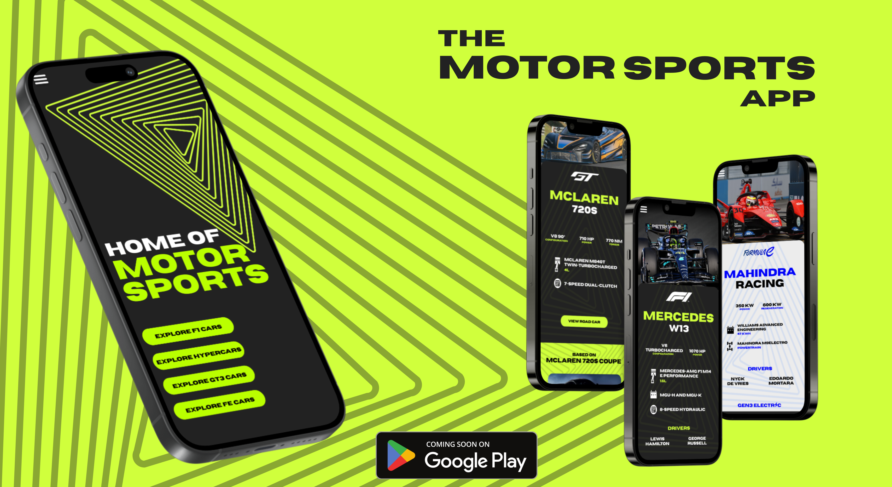

# The Motorsports App 🏁✨

 



The Motorsports App is a comprehensive mobile application that serves as the ultimate destination for enthusiasts and fans of high-performance racing. This application caters to the discerning tastes of motorsports aficionados by offering detailed specifications of cars used in prestigious racing categories such as Formula 1, Formula E, GT3 Racing, LMH (Le Mans Hypercar), and LMDh (Le Mans Daytona hybrid).

## Development

### Install dependencies

```bash
yarn
```

### Getting Started

First, run the development server:

```bash
# For web
yarn web
# For ios
yarn ios
# For android
yarn android
# Generally
yarn start
```

## Tech Stack

###  Made with gluestack-io

## Contributors

<a href="https://github.com/rohanmohapatra/motorsports-app/graphs/contributors">
  
</a>
